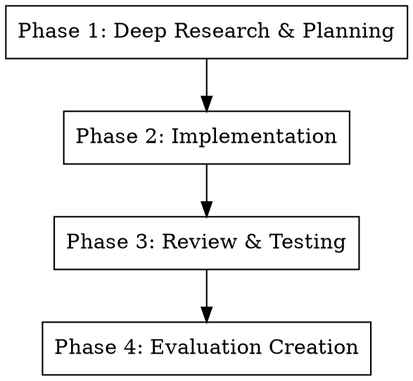

# MCP Builder

## Overview

**MCP Builder** guides creation of Model Context Protocol (MCP) servers that enable LLMs to interact with external services through well-designed tools. The quality of an MCP server is measured by how well it enables LLMs to accomplish real-world tasks.

**Core principle:** Design discoverable, composable tools that agents can use effectively to solve complex problems.

## When to Use

Use this skill when you need to:
- Build MCP servers exposing external service APIs to language models
- Design tool interfaces for agent interaction
- Create evaluation suites to validate server effectiveness
- Implement TypeScript or Python-based MCP servers
- Connect LLMs to databases, APIs, or custom services

**Don't use when:**
- Building non-MCP integrations
- Creating simple one-off scripts (overkill)
- Service doesn't require agent interaction

## Four-Phase Workflow



### Phase 1: Deep Research and Planning

**1. Understand MCP Design Philosophy**

Two approaches exist:
- **Comprehensive API Coverage:** Expose all/most endpoints as individual tools
- **Specialized Workflows:** Create higher-level workflow tools

**Choose based on client capabilities:** Some clients benefit from composable basic tools, others need pre-built workflows.

**2. Study the Protocol**

Start at MCP specification sitemap:
```
https://modelcontextprotocol.io/sitemap.xml
```

Access markdown versions using `.md` suffix for detailed specs.

**3. Framework Selection**

**Recommended:** TypeScript with HTTP transport (remote) or stdio (local)
- High-quality SDK support
- Good compatibility across environments
- Strong typing for reliability

**Alternative:** Python with Pydantic for schema validation

**4. Implementation Planning**

- Review target service API documentation
- Identify key endpoints and operations
- Prioritize comprehensive coverage
- List common use cases first
- Map endpoints to tool designs

### Phase 2: Implementation

**Project Structure**

Follow language-specific guides for proper organization:
```
my-mcp-server/
  src/
    index.ts          # Main server entry point
    tools/            # Tool implementations
    client.ts         # API client setup
    utils/            # Shared utilities
  package.json        # Dependencies
  tsconfig.json       # TypeScript config
```

**Core Infrastructure**

Establish shared utilities:
- **API Client:** Authentication, base configuration
- **Error Handling:** Consistent error formatting
- **Response Formatting:** JSON + Markdown output
- **Pagination Support:** Handle large result sets

**Tool Implementation Requirements**

Each tool needs:

1. **Input Schema** (Zod for TypeScript, Pydantic for Python)
```typescript
const CreateIssueSchema = z.object({
  repo: z.string().describe("Repository name (owner/repo)"),
  title: z.string().describe("Issue title"),
  body: z.string().optional().describe("Issue description"),
  labels: z.array(z.string()).optional()
});
```

2. **Output Schema** with structured content
```typescript
return {
  content: [
    {
      type: "text",
      text: `Issue #${issueNumber} created: ${title}`
    },
    {
      type: "resource",
      resource: {
        uri: issueUrl,
        mimeType: "text/html"
      }
    }
  ]
};
```

3. **Clear Descriptions** with parameter details
```typescript
{
  name: "github_create_issue",
  description: "Create a new issue in a GitHub repository. Returns issue number and URL.",
  inputSchema: CreateIssueSchema
}
```

4. **Async/Await Patterns** for I/O operations

5. **Actionable Error Messages** with specific suggestions
```typescript
throw new Error(
  `Repository not found: ${repo}. Check spelling and access permissions. ` +
  `Use github_list_repos to see available repositories.`
);
```

6. **Tool Annotations** for behavior hints
```typescript
{
  name: "github_delete_repo",
  description: "Permanently delete a repository",
  annotations: {
    destructive: true,    // Warns before execution
    readOnly: false,
    idempotent: false
  }
}
```

**Design Conventions**

- **Naming:** Consistent prefixes (e.g., `github_create_issue`, `github_list_repos`)
- **Concise Descriptions:** Enable agent discoverability
- **Context Management:** Focused, paginated results (don't return 1000 items)
- **Error Messages:** Provide specific suggestions and next steps

### Phase 3: Review and Testing

**Code Quality Checks**

- [ ] Eliminate code duplication
- [ ] Ensure consistent error handling across all tools
- [ ] Maintain full type coverage (TypeScript) or type hints (Python)
- [ ] Verify clear, descriptive tool descriptions
- [ ] Check input validation on all parameters
- [ ] Confirm async operations use proper patterns

**Build and Test**

**TypeScript:**
```bash
npm run build
npx @modelcontextprotocol/inspector
```

**Python:**
```bash
# Verify syntax
python -m py_compile src/*.py

# Test with MCP Inspector
npx @modelcontextprotocol/inspector
```

**Inspector Testing:**
- Connect to your server
- Test each tool manually
- Verify error handling
- Check output formatting
- Confirm pagination works

### Phase 4: Evaluation Creation

**Purpose:** Verify LLMs can effectively use your server to answer realistic, complex questions.

**Question Generation Process**

1. **Inspect available tools** and capabilities
2. **Use read-only operations** to explore available data
3. **Create 10 independent, realistic questions**
4. **Verify answers** by solving them yourself

**Question Requirements**

- **Independent:** Each stands alone (not sequential)
- **Read-only:** No destructive operations
- **Complex:** Requires 2+ tool calls to answer
- **Realistic:** Real-world scenarios users would ask
- **Verifiable:** Single clear answer
- **Stable:** Answer won't change over time

**Output Format**

```xml
<evaluation>
  <qa_pair>
    <question>What are the top 3 most commented issues in the main repository created in the last 30 days?</question>
    <answer>Issue #542 (47 comments), Issue #538 (35 comments), Issue #521 (28 comments)</answer>
  </qa_pair>
  <qa_pair>
    <question>Which contributor has the most merged pull requests across all repositories?</question>
    <answer>alice-dev with 127 merged PRs</answer>
  </qa_pair>
  <!-- 8 more qa_pairs -->
</evaluation>
```

## Quick Reference

| Phase | Key Outputs | Tools/Commands |
|-------|-------------|----------------|
| **1. Research** | Framework choice, endpoint list, tool designs | MCP spec, API docs |
| **2. Implementation** | Working MCP server, tool implementations | TypeScript/Python, Zod/Pydantic |
| **3. Testing** | Verified functionality, fixed bugs | MCP Inspector, manual testing |
| **4. Evaluation** | 10 Q&A pairs for validation | Read-only tool exploration |

## Implementation Example

### Example Tool: GitHub Create Issue

```typescript
import { z } from "zod";

// Input schema
const CreateIssueSchema = z.object({
  owner: z.string().describe("Repository owner username"),
  repo: z.string().describe("Repository name"),
  title: z.string().describe("Issue title"),
  body: z.string().optional().describe("Issue description (markdown)"),
  labels: z.array(z.string()).optional().describe("Labels to apply")
});

// Tool registration
server.setRequestHandler(CallToolRequestSchema, async (request) => {
  if (request.params.name === "github_create_issue") {
    const args = CreateIssueSchema.parse(request.params.arguments);

    try {
      const response = await octokit.rest.issues.create({
        owner: args.owner,
        repo: args.repo,
        title: args.title,
        body: args.body,
        labels: args.labels
      });

      return {
        content: [
          {
            type: "text",
            text: `✓ Created issue #${response.data.number}: ${response.data.title}\n\nURL: ${response.data.html_url}`
          }
        ]
      };
    } catch (error) {
      if (error.status === 404) {
        throw new Error(
          `Repository ${args.owner}/${args.repo} not found. ` +
          `Check spelling or use github_list_repos to see available repositories.`
        );
      }
      throw error;
    }
  }
});

// Tool metadata
{
  name: "github_create_issue",
  description: "Create a new issue in a GitHub repository. Returns issue number and URL.",
  inputSchema: zodToJsonSchema(CreateIssueSchema),
  annotations: {
    readOnly: false,
    idempotent: false
  }
}
```

## Common Mistakes

| Mistake | Fix |
|---------|-----|
| **Too many low-level tools** | Balance comprehensive coverage with usability |
| **Vague tool descriptions** | Be specific: what it does, what it returns |
| **No error guidance** | Errors should suggest next steps |
| **Returning massive datasets** | Implement pagination, limit results |
| **Inconsistent naming** | Use prefixes: `service_action_resource` |
| **Missing type validation** | Use Zod/Pydantic for all inputs |
| **No evaluation suite** | Can't verify if agents can actually use your server |
| **Destructive tools without warnings** | Use `destructive: true` annotation |

## Reference Materials

**Official Documentation:**
- [MCP Best Practices](https://modelcontextprotocol.io/best-practices)
- [TypeScript SDK Guide](https://modelcontextprotocol.io/typescript)
- [Python SDK Guide](https://modelcontextprotocol.io/python)
- [Evaluation Guide](https://modelcontextprotocol.io/evaluations)

**Example Implementations:**
- GitHub MCP Server (reference implementation)
- Slack MCP Server
- Database MCP Servers

**Tools:**
- `@modelcontextprotocol/inspector` - Interactive testing
- `@modelcontextprotocol/sdk` - TypeScript SDK
- `mcp` Python package - Python SDK

## Design Principles Summary

1. **Discoverable:** Tool names and descriptions enable agent self-service
2. **Composable:** Basic tools combine to solve complex problems
3. **Contextual:** Return focused, relevant information (not everything)
4. **Guided:** Error messages provide specific next steps
5. **Reliable:** Proper error handling, type validation, async patterns
6. **Verifiable:** Evaluation suite proves effectiveness

## Real-World Impact

**Before MCP Server:**
- Manual API calls
- No agent autonomy
- Hardcoded workflows

**After MCP Server:**
- Agents compose tools independently
- Solve novel problems without new code
- Adaptable to new use cases

**Quality metric:** Can an LLM answer complex, multi-step questions using your server? Evaluation suite proves it.
