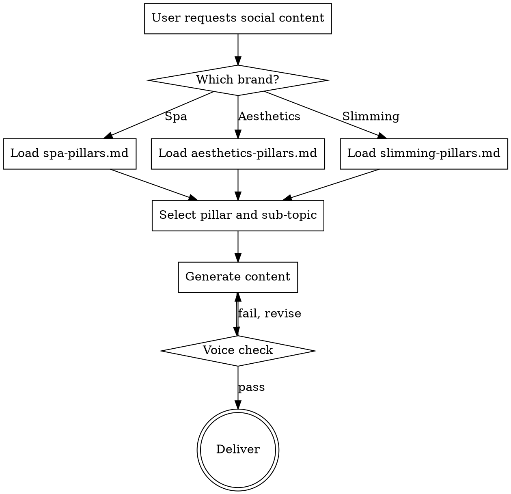

# Social Media Content & Creative Strategy

## Overview

Create on-brand social media content for Carisma's three brands using pre-built content pillars, hook libraries, and format templates. Every piece of content must pass through the correct brand pillar file before being written.

**Core principle:** Never write social content from scratch. Always start from the pillar file — select the pillar, pick the sub-topic, choose a hook template, then adapt for the requested format and platform.

## When to Use

- Creating Instagram captions, Facebook posts, or TikTok copy
- Writing reel scripts or TikTok scripts
- Planning Instagram Story sequences
- Building weekly or monthly content calendars
- Creating creative briefs for social media content production
- Generating hook ideas or scroll-stopping openers
- Planning viral content replication
- Reviewing or editing social media copy for brand voice compliance

## When NOT to Use

- **Paid ad copy** — use `carisma-slimming-ad-copy` skill instead
- **Google Business Profile posts** — use the GBP posting workflow
- **Email marketing** — use `email-sequence` skill
- **General copywriting** — use `copywriting` skill

## Brand Routing

### Step 1: Identify Brand and Load Pillar File

| Brand | Pillar File | Persona | Signature |
|-------|------------|---------|-----------|
| **Carisma Spa** | `marketing/marketing-calendar/social-media/spa-pillars.md` | Sarah Caballeri | "Peacefully, Sarah" |
| **Carisma Aesthetics** | `marketing/marketing-calendar/social-media/aesthetics-pillars.md` | Sarah | "Beautifully yours, Sarah" |
| **Carisma Slimming** | `marketing/marketing-calendar/social-media/slimming-pillars.md` | Katya | "With you every step, Katya" |

**ALWAYS read the full pillar file before writing.** The pillar files contain hook templates, caption frameworks, script skeletons, story sequences, platform notes, and voice guardrails for every sub-topic.

### Step 2: Also Load Brand Voice Config

Each pillar file contains a social-specific Brand Voice Summary in its first section. The config files contain the master brand voice. Use both when they differ; the pillar file takes precedence for social content.

- `config/brands.json` — master brand voice definition (tone, personality, do/don't rules)
- `config/branding_guidelines.md` — emotional journey framework for Slimming (Validation > Relief > Permission > Excitement), copy examples, and avatar definitions

### Handling Topics That Appear Under Multiple Pillars

Some topics (e.g., menopause belly) appear under both Pain-Solution and Hooked Insight with different angles. When the user does not specify a pillar:
- Ask which angle they want (empathy-led Pain-Solution or surprise-led Hooked Insight)
- If urgency prevents asking, default to Pain-Solution (it validates first, which aligns with brand voice)
- Draw hook templates from both sections to offer variety

## Content Pillars by Brand

### Carisma Spa (4 Pillars)
| Pillar | Purpose | Ratio |
|--------|---------|-------|
| Pain-Solution | Lifestyle frustrations a spa visit solves | 30% |
| Hooked Insight | Surprising wellness/spa science facts | 25% |
| Objection Flip | Dismantle objections to treating yourself | 20% |
| Viral Replication | Trending formats adapted for spa | 25% |

### Carisma Aesthetics (4 Pillars)
| Pillar | Purpose | Ratio |
|--------|---------|-------|
| Pain-Solution | Skin/face concerns and clinical fixes | 30% |
| Hooked Insight | Treatment myths and surprising truths | 30% |
| Objection Flip | Fear of looking fake, pain, side effects | 20% |
| Viral Replication | Trending aesthetics content formats | 20% |

### Carisma Slimming (5 Pillars)
| Pillar | Purpose | Ratio |
|--------|---------|-------|
| Pain-Solution | Body frustrations and what actually works | 25% |
| Hooked Insight | Weight loss myths and science | 20% |
| Objection Flip | "Fat freezing is a scam" and other myths | 20% |
| Viral Replication | Trending weight loss content formats | 15% |
| Behind-the-Clinic | Educational authority-building content | 20% |

## Output Workflows

### A. Single Post (Caption)

1. Read the brand's pillar file
2. Select pillar and sub-topic based on the brief
3. Use the **Caption Framework** section for that sub-topic
4. Structure: Hook line > Body (3-5 lines) > CTA
5. Add relevant hashtags from the pillar file's Hashtag Strategy section
6. Run voice check against brand's DO/DON'T rules
7. Present to user for approval

### B. Reel or TikTok Script

1. Read the brand's pillar file
2. Select pillar and sub-topic
3. Use the **Reel/TikTok Script Skeleton** for that sub-topic
4. Structure: Hook (0-3s) > Body (3-25s) > CTA (25-30s)
5. For each timestamp segment, specify separately: spoken words, on-screen text overlay, and visual/B-roll direction
6. Suggest audio mood (calm/empowering for slimming, confident/clean for aesthetics, warm/sensory for spa). Note: specific trending sounds change weekly, so suggest a mood, not a track.
7. Add platform-specific notes (IG Reels vs TikTok differences)
8. Present to user for approval

### C. Instagram Story Sequence

1. Read the brand's pillar file
2. Select pillar and sub-topic
3. Use the **Story Sequence** section (3-5 frames per sub-topic)
4. Each frame: Visual direction + text overlay + interactive element (poll, quiz, slider)
5. Final frame: CTA with link sticker or DM prompt
6. Present to user for approval

### D. Content Calendar (Weekly or Monthly)

1. Read the brand's pillar file
2. Use the **Content Calendar Framework** and **pillar ratios** from the file
3. Map pillars to days based on the recommended weekly rhythm
4. For each slot: specify pillar, sub-topic, format (reel/carousel/story/static), and platform
5. Include hook preview for each post
6. Cross-reference with `quarterly-marketing-calendar` skill for seasonal alignment
7. Present calendar as a table for user approval

**Weekly calendar template:**

| Day | Platform | Pillar | Sub-Topic | Format | Hook Preview |
|-----|----------|--------|-----------|--------|-------------|
| Mon | IG + FB | Pain-Solution | [from pillar file] | Reel | [hook] |
| Wed | TikTok + IG | Hooked Insight or Objection Flip | [from pillar file] | TikTok / Carousel | [hook] |
| Fri | IG + TikTok | Viral Replication or [varies] | [from pillar file] | Reel | [hook] |

**Posting frequency:** 3x per week (Monday, Wednesday, Friday). ~13 posts per brand per month.
**Stories:** Also 3x per week, aligned to the same days as posts (Mon, Wed, Fri).

### E. Creative Brief

1. Read the brand's pillar file
2. Select pillar, sub-topic, and format
3. Structure the brief:
   - **Objective:** What this content should achieve
   - **Platform(s):** Where it will be posted
   - **Format:** Reel / Static / Carousel / Story Sequence
   - **Pillar:** Which content pillar
   - **Hook:** The scroll-stopping opener (from pillar file templates)
   - **Script/Copy:** Full caption or script
   - **Visual Direction:** Shot-by-shot or frame-by-frame guidance
   - **Brand Voice Notes:** Specific guardrails from the pillar file
   - **CTA:** The desired action
   - **Hashtags:** From pillar file's hashtag strategy
4. Present to user for approval

## Voice Check Protocol

Before delivering ANY content, verify against these gates:

### All Brands
- [ ] Hook is scroll-stopping (not generic)
- [ ] Copy speaks directly to her (second person "you")
- [ ] CTA is clear and specific
- [ ] No em-dashes (use commas or full stops instead)
- [ ] UK spelling throughout
- [ ] Platform-appropriate length and format

### Spa-Specific
- [ ] Sensory language present (feel, imagine, indulge, unwind)
- [ ] Permission-giving tone ("you deserve", "your moment")
- [ ] No clinical or medical framing
- [ ] No pushy sales language
- [ ] Malta lifestyle references where natural

### Aesthetics-Specific
- [ ] Confident and reassuring (not fear-based)
- [ ] Natural-looking results emphasised (never "dramatic transformation")
- [ ] Consultation-first approach mentioned where relevant
- [ ] No before/after claims that violate advertising standards
- [ ] Treatments explained without excessive jargon

### Slimming-Specific
- [ ] Validates her experience before offering solutions
- [ ] No shame, blame, or guilt language
- [ ] Emotional journey present (Validation > Relief > Permission > Excitement)
- [ ] Talks about how life feels, not just numbers
- [ ] Normalises setbacks and imperfection
- [ ] No toxic positivity or unrealistic promises

## Platform Quick Reference

| Platform | Best Formats | Posting Time (Malta) | Key Notes |
|----------|-------------|---------------------|-----------|
| Instagram Feed | Carousels, single image | 10:00-12:00, 19:00-21:00 | SEO-rich captions, alt text |
| Instagram Reels | 15-30s vertical video | 11:00-13:00, 18:00-20:00 | Trending audio, text overlays |
| Instagram Stories | Polls, quizzes, behind-scenes | Throughout day | Interactive elements drive reach |
| Facebook | Native video, link posts | 09:00-11:00 | Longer captions perform well |
| TikTok | 15-60s vertical video | 12:00-14:00, 19:00-22:00 | Raw/authentic > polished |

## Multi-Brand Content Calendar

When creating content across all three brands simultaneously:

1. Read ALL three pillar files
2. Avoid scheduling the same pillar type on the same day across brands
3. Coordinate seasonal themes (e.g., Mother's Day across all three, each with their angle)
4. Each brand maintains its distinct voice — never blend voices in a single post
5. Cross-promote only where natural (e.g., spa gift voucher in aesthetics story)

## Common Mistakes

| Mistake | Fix |
|---------|-----|
| Writing generic hooks not from pillar file | Always start from the sub-topic's hook templates |
| Mixing brand voices across brands | Load only one brand's pillar file at a time |
| Skipping the voice check | Run the checklist before every delivery |
| Using em-dashes | Replace with commas or full stops |
| Clinical language in spa content | Use sensory/experiential framing instead |
| Shame language in slimming content | Validate first, then offer the solution |
| Promising dramatic results in aesthetics | Emphasise natural, subtle enhancement |
| Same pillar every day | Follow the ratio from the pillar overview table |
| Posting 5x/week (Mon-Fri daily) | Post 3x/week only: Mon, Wed, Fri. Stories also 3x/week on same days. |
| Posting on Tue, Thu, Sat, or Sun | Only Mon, Wed, Fri. No other days. |
| Ignoring platform differences | Check the Platform-Specific Notes for each sub-topic |

## Related Skills

- **quarterly-marketing-calendar** — seasonal campaign planning (align content calendar with campaigns)
- **carisma-slimming-branding** — deep brand voice reference for slimming
- **carisma-slimming-ad-copy** — paid Meta ad copy (not organic social)
- **copywriting** — general copy principles
- **social-content** — generic social media strategies (this skill supersedes it for Carisma brands)
